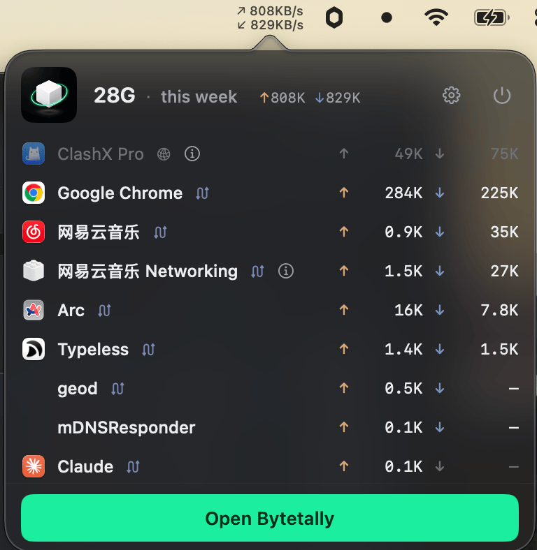
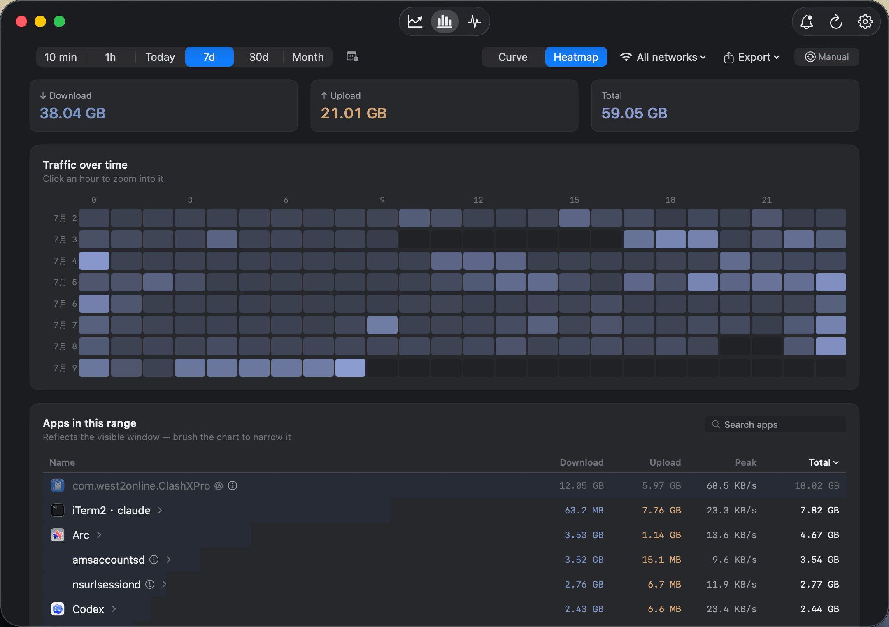
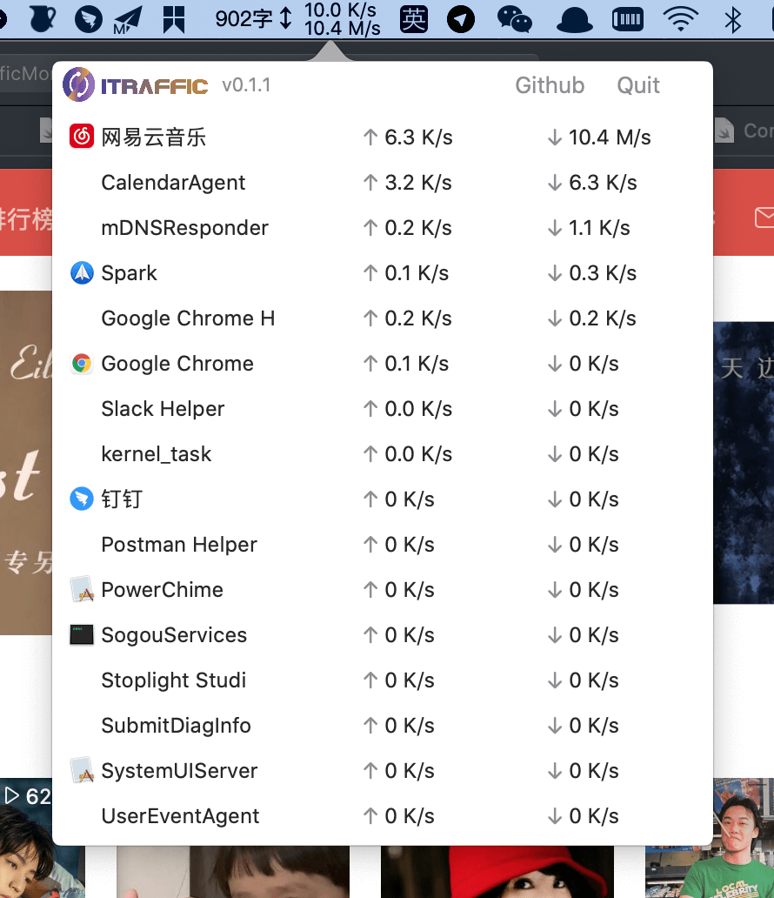

<div align="center">

# iTraffic for macOS

A lightweight, open-source per-process network speed monitor for your Mac menu bar.

[Download iTraffic](https://github.com/foamzou/ITraffic-monitor-for-mac/releases/latest)
· [Install with Homebrew](#install--update)
· [Meet Bytetally](https://bytetally.app/)

</div>

## Want more than a live speed meter?

**[Try Bytetally Free](https://bytetally.app/)** — the modern, separately developed commercial edition from the same developer.

Bytetally Free goes far beyond iTraffic's real-time list. It adds a native dashboard, month-to-date usage, a 7-day device trend, monthly top apps, live charts, app drill-down, and accurate attribution through VPNs and local proxies. Core monitoring is free forever, with no account, and your network-usage data stays on your Mac.

<p align="center">
  <a href="https://bytetally.app/">
    
  </a>
  <br />
  <sub>Bytetally turns raw network activity into a clear timeline and shows which apps are responsible. Some features shown require Pro.</sub>
</p>

### Choose the version that fits you

| Capability | iTraffic OSS | Bytetally Free | Bytetally Pro |
|---|:---:|:---:|:---:|
| Source available to inspect and modify | ✅ | — | — |
| Minimum macOS version | 10.15 | 14 Sonoma | 14 Sonoma |
| Live upload/download by process or app | ✅ | ✅ | ✅ |
| Live rate in the menu bar | ✅ | ✅ | ✅ |
| Native dashboard and per-app live charts | — | ✅ | ✅ |
| Month overview, 7-day device trend, and monthly top apps | — | ✅ | ✅ |
| Attribution through VPNs and local proxies | — | ✅ | ✅ |
| Mac App Store install and full sandboxing | — | ✅ | ✅ |
| Long-range per-app rankings and traffic heatmap | — | — | ✅ |
| Data caps and separate budgets for each Wi-Fi network | — | — | ✅ |
| Unusual-upload alerts | — | — | ✅ |
| Limit or block an app, automatic overage actions, CSV/JSON export | — | — | ✅ |

Choose **iTraffic** if you want a small, hackable open-source utility or need to support an older macOS release. Choose **Bytetally Free** if you want the stronger ready-to-use experience; upgrade only if you need deeper per-app history, budgets, alerts, control, or export.

<p align="center">
  <a href="https://bytetally.app/"><strong>Download Bytetally Free</strong></a>
  &nbsp;·&nbsp;
  <a href="https://bytetally.app/">Explore all features</a>
</p>

<table>
  <tr>
    <td width="42%" align="center">
      <a href="https://bytetally.app/"></a>
      <br />
      <strong>Bytetally Free</strong><br />
      <sub>Live menu-bar rate and per-app traffic</sub>
    </td>
    <td width="58%" align="center">
      <a href="https://bytetally.app/"></a>
      <br />
      <strong>Bytetally Pro</strong><br />
      <sub>Deep history, heatmaps, budgets, alerts, controls, and export</sub>
    </td>
  </tr>
</table>

Bytetally Pro features include a free trial and can then be unlocked with a subscription or one-time lifetime purchase. [See current details on the Bytetally website.](https://bytetally.app/#pricing)

## About iTraffic

iTraffic keeps one job simple: show which processes are using your network right now.

- Per-process upload and download speeds
- Native macOS menu-bar interface
- Light and dark mode
- Direct Swift driver for macOS `nettop`
- Delta-mode sampling for more accurate live rates

## Requirements

macOS 10.15 Catalina or later.

## Install & update

Choose either option:

1. Download the ZIP from the [latest GitHub release](https://github.com/foamzou/ITraffic-monitor-for-mac/releases/latest).
2. Install with Homebrew:

   ```bash
   brew install itraffic
   ```

   To update later:

   ```bash
   brew update
   brew upgrade itraffic
   ```

## Build from source

This project is generated from `project.yml` with [XcodeGen](https://github.com/yonaskolb/XcodeGen).

1. Install XcodeGen: `brew install xcodegen`
2. Generate the project: `xcodegen generate`
3. Open `ITrafficMonitorForMac.xcodeproj`

## iTraffic screenshot



## Thanks

- [eul](https://github.com/gao-sun/eul) — an early reference while learning Swift

## License

See [LICENSE](./LICENSE).

## Star history

[](https://star-history.com/#foamzou/ITraffic-monitor-for-mac&Date)
